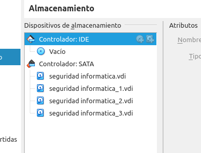

INTRODUCCION
    la redundancia le da un nivel más de seguridad a nuestro sistema en esta actividad lograremos un raid 10 en el servidor.


DESARROLLO

1.paso:
Añadimos los discos virtual a nuestra máquina virtual en VirtualBox(cada disco cuenta con 50,09 Gb)


()


También con el comando lsblk podemos ver nuestros discos instalados en nuestra máquina


2.paso:
creamos los  dos raids 1 correspondientes con el comando mdadm con la siguiente extructura:
```bash
mdadm --create /dev/md0 --level=1 \
    --raid-devices=2 /dev/sdc /dev/sdb
mdadm --create /dev/md1 --level=1 \
    --raid-devices=2 /dev/sde /dev/sdd
```
3.paso:
Acontinuación creamos el volumen fisico:
```bash
pvcreate /dev/md0
```
4.paso
